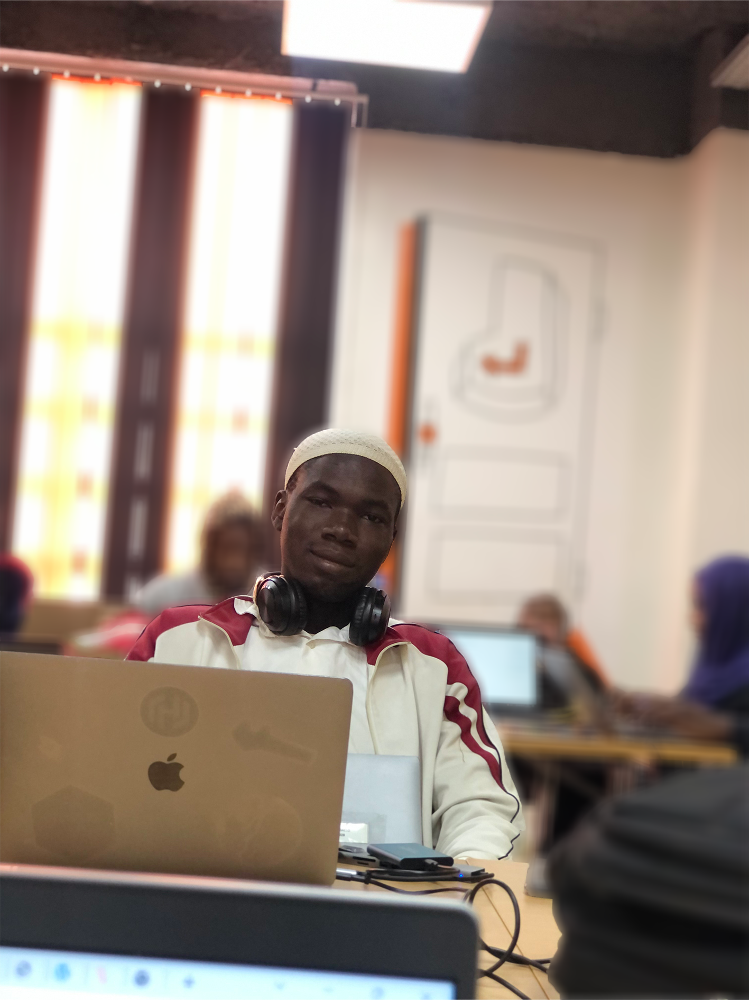

### Hi there 👋... I'm BALLO Ibrahima
<!--  -->

- 🔭 I am currently working on spring boot, angular, ionic projects
- 🌱 I’m currently learning IA
- 👯 I’m looking to collaborate on IA project
- 👀 I’m interested in IA, spring boot, angular, ionic, flutter ...
- 📫 How to reach me: ibrahimaballo01@gmail.com

|
<!--||
|-|-->
-|

<!-- 
&nbsp;
 -->

  

<!--  -->

<!--
**BalloIbrahima/BalloIbrahima** is a ✨ _special_ ✨ repository because its `README.md` (this file) appears on your GitHub profile.

Here are some ideas to get you started:

- 🔭 I’m currently working on ...
- 🌱 I’m currently learning ...
- 👯 I’m looking to collaborate on ...
- 🤔 I’m looking for help with ...
- 💬 Ask me about ...
- 📫 How to reach me: ...
- 😄 Pronouns: ...
- ⚡ Fun fact: ...
-->
